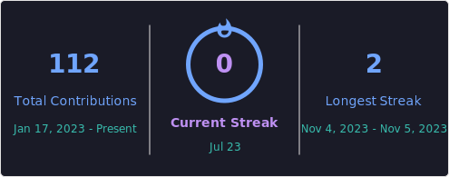

 

 

### 👨‍💻 About Me

- 🤖 **AI Engineer** with hands-on experience building LLM-powered solutions using **GPT-3.5, GPT-4, LLaMA 2, Gemini** and **RAG pipelines**
- 🎓 MCA (CGPA 9.25/10, First Class with Distinction) from **SRM Institute of Science and Technology**, Chennai
- 🏢 Worked as an **AI Engineer — Computer Vision & Edge AI** at **MIBOT Ventures India Pvt Ltd**, building real-time hazard-detection and edge-inference pipelines
- 🏆 2nd Prize — **HACKOUT 2023, IIT Madras** (as Team Lead)
- 📍 Based in Chennai, India
- 💬 Ask me about RAG pipelines, LangChain, Computer Vision, Edge AI, or full-stack GenAI apps

### 🚀 What I'm Building Right Now

- 🛡️ **SHIELD** — a women's safety platform pairing a smartphone app with an IoT wearable that passively monitors biometrics and computer-vision signals to compute a real-time "Danger Index" for autonomous emergency escalation
- 🔧 A **Predictive Maintenance System** — Kafka data pipeline, XGBoost/LSTM/Isolation Forest models, SHAP explainability, FastAPI inference layer, React dashboard, deployed on AWS with CI/CD

### 🧰 Tech Stack

**Languages, Frameworks & Cloud**

**AI / LLM / GenAI**

**Data & BI**

### 📌 Featured Projects

<table>
<tr>
<td width="50%">

**⚠️ Automated Hazard-Detection In Industrial areas**
Engineered a real-time hazard-detection framework for industrial safety, elevating accuracy by 12% and eliminating 10+ hours per week of manual quality checks.
`Python` `OpenCV` `Deep Learning` `TensorRT`

</td>

<td width="50%">

**💰 Financial Health Assessment Platform**
Full-stack SME analytics tool with React + FastAPI + PostgreSQL; uses GPT-4 to turn financial risk scores into plain-language explanations for 50+ concurrent users.
`React` `FastAPI` `PostgreSQL` `OpenAI GPT-4` `RAG`

</td>
</tr>
<tr>
<td width="50%">

**🎓 ProboTutor — Intelligent Chatbot**
RAG-powered Q&A assistant built on Google Gemini + LLaMA 2, tested across 500+ queries with a 95% satisfaction rate.
`Gemini` `LLaMA 2` `RAG` `Prompt Engineering`

</td>
<td width="50%">

**🏖️ Beach Surveillance Face Recognition**
Developed an embedding-based edge AI system using InsightFace (Buffalo-l) to identify suspects in real time, achieving 98.7% accuracy, 22% fewer false positives, and 25–30 FPS.
`InsightFace` `Buffalo-l` `NumPy` `Edge AI`

</td>
</tr>
</table>

### 📈 GitHub Stats

<table>
  <tr>
    <td width="50%" valign="top"></td>
    <td width="50%" valign="top"></td>
  </tr>
  <tr>
    <td colspan="2"></td>
  </tr>
</table>

> These three cards are generated by the "Update profile cards" GitHub Action and live at `profile/stats.svg`, `profile/top-langs.svg`, and `profile/streak.svg` in this repo — see the workflow setup below.

### 📅 Contribution Graph

### 🎓 Education & Certifications

- **MCA**, SRM Institute of Science and Technology — CGPA 9.25/10 (2022–2024)
- **BCA**, SRM Institute of Science and Technology — CGPA 8.66/10 (2019–2022)
- Google Cloud Computing Foundations (Data, ML & AI) · Fundamentals of Azure AI · Microsoft Career Essentials in Generative AI · IBM AI & Machine Learning Programme

